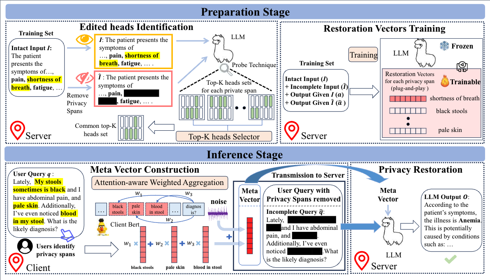

# PrivacyRestore: Privacy-Preserving Inference in Large Language Models via Privacy Removal and Restoration

Source code for ACL2025 paper titled "[PrivacyRestore: Privacy-Preserving Inference in Large Language Models via Privacy Removal and Restoration](https://arxiv.org/abs/2406.01394)".

  

  **Figure 1:** The PrivacyRestore consists of two stages. (1) **Preparation Stage**. This stage aims to identify the edited heads and train the restoration vectors. (2) **Inference Stage**. In this stage, the client constructs a meta vector. The server uses the meta vector to restore information during inference on the incomplete query.

- We propose a plug-and-play privacy protection method that removes privacy spans in the
input and restores private information via activation steering during inference.

- We propose Attention-aware Weighted Aggregation to construct the meta vector and apply the dχ-privacy mechanism to the meta vector, inherently addressing the problem of the linear growth of privacy budget.

- We construct three datasets, covering the medical and legal fields, to evaluate our method. Experimental results demonstrate its capabilities of privacy protection. It also maintains acceptable performance and inference efficiency.

## Brief Instructions

- The code of PrivacyRestore is in `./PrivacyRestore` subdir. Detailed usage is provide in `./PrivacyRestore/README.md`.
- The three privacy-preserving datasets we created is in `./Datasets` subdir. Detailed usage is provide in `./Datasets/README.md`.

## Release of Our Pretrained Vectors

> https://pan.baidu.com/s/1MsAmnA6fo0-iKY4BXNLAyA?pwd=k4yb
